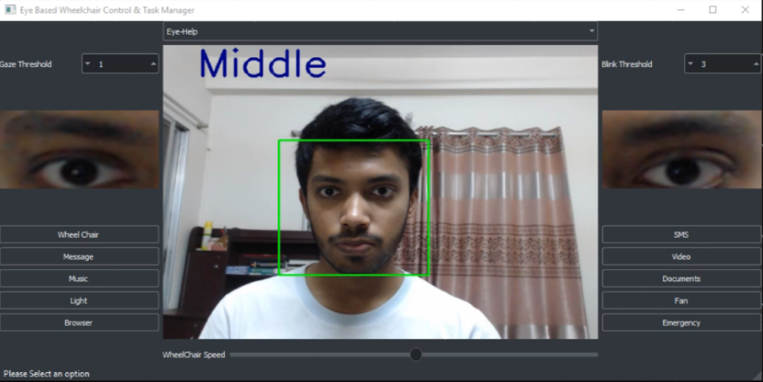
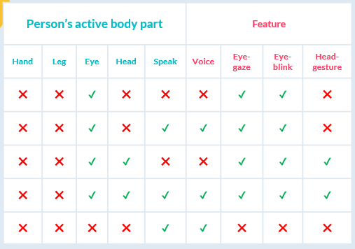
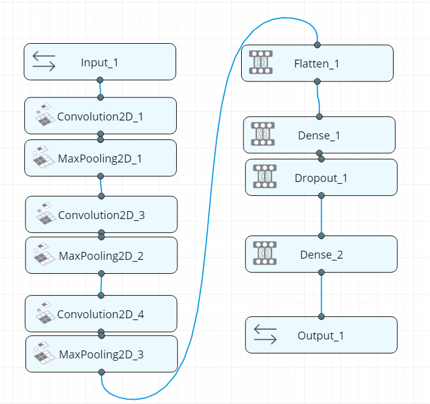
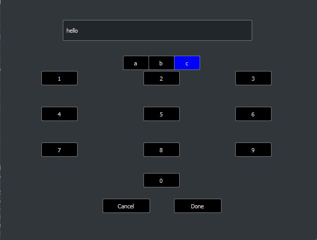
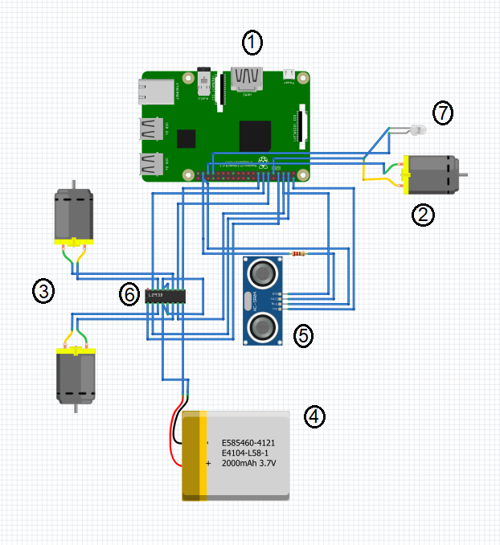

>  

# Eye Based Wheelchair Control and Task Manager for Disabled Person
> Primary Release v2

## Python Package Dependencies
1. keras/keras-gpu
2. opencv
3. pyqt
4. qdarkstyle
5. pyautogui
6. pyaudio
7. xlib
8. dlib
9. speechrecognizer
10. imutils

## Quick start running the project
1. `git clone https://github.com/sakibreza/EyeTask-V2.0.git`
2. Install required python dependencies into your python virtual environment.
3. Fix some paths in the `Resources/ResourceBrowser.py`, `Resources/ResourceMusic.py`, `Resources/ResourceMusic.py`, `Resources/ResourcePdf.py` and `Resources/ResourceVideo.py` files.
4. Add this <a href="https://github.com/AKSHAYUBHAT/TensorFace/blob/master/openface/models/dlib/shape_predictor_68_face_landmarks.dat">dlib model</a> to 'input' folder
5. `python3 main.py`

## Introduction
In this project, we designed and implemented a system that will use users’ eye gaze, eye blinks, head gestures or voice commands to control its functionality. The system has a task manager GUI which has functionality of wheelchair controlling, phone calling, SMS/email sending, e-book reading, web browsing, Google searching, light/fan operating, keyboard operating and so on. Peripheral devices of our system – electric wheelchair, Light, Fan etc. are hosted by a raspberry pi and communicate with the main system through a Wi-Fi network. We have different modes for person with different disability depending on users’ active body parts (figure-1.1)

Fig: Differenct modes of operation with features depending on users' active body parts

## Motivation
The project is made for the international competition IEEE SS12: Innovation Challenge 2018

## Features
* Task manager control with eye blinks/head gestures/voice command
* Wheelchair control with eye gaze/head gestures/voice command 
* SMS/Email sending with eye/head controlled keyboard
* Audio/Video player control with eye blinks/head gestures/voice command
* E-book reader control with eye blinks/head gestures/voice command
* Web browser control with eye blinks/voice command
* Light/Fan operating with eye blinks/voice command
* Emergency alert sending with eye blinks/voice command

## Software Design
### Graphical User Interface
We used PyQt5 framework to design our GUI for user. For styling our GUI we have used a library called QdarkStyle.

### Computer Vision
In the initial version of our system we had used two different model for eye gaze and eye blinks. We had used a haarcascade classifier model for eye gaze trained with 1000+ sample and for eye blinks we got an EAR value from pre-trained facial landmark recognizer with dlib and determined left blink, right blink and both blink.
For the present version of our system we developed a single Convolutional Neural Network (CNN) architecture that is a modified version of VGG-8 architecture for classifying all four classes (left gaze, center gaze, right gaze, and blink).We used two separate model for left eye and right eye, final result is integrated with both of the results.  We trained our model with 6000+ sample and got 97% accuracy on our own test set.

### The virtual extraordinary keyboard
User can write any message using a specially designed virtual keyboard which can be controlled using eye gaze and eye blinks. The keyboard has 12 main keys and every main keys has 2-4 floating keys. Main keys are navigated using eye blinks and the floating keys are navigated using eye gaze. There has also some prewritten message to send.

### Audio/Video player
User can control the audio/video player using eye blinks. Such as- right blink will scroll through the audio/video lists, both blinks will select an option and right blink will pause or get out from the audio/video player.  

### E-book reader
User can navigate and read by scrolling up/down any e-book using eye blinks. Such as – left blink works for scroll up and right blink works for scroll down.

### Web browser
User can browse through web using special eye controlled virtual keyboard and there has also some predefined webpages which can be navigated using eye blinks. Web pages can be scrolled using eye blinks

### Emergency alert
On the task manager there is an ‘Emergency Alert’ option. If the user select this option, a SMS will be sent to a fixed recipient asking emergency help for user.

### SMS/Email API
For SMS, we used Onnorokom SMS API to send SMS anywhere in Bangladesh. For Email, We used the Gmail API. 

### Voice API
We used Google voice API service to take the voice input (/voice command) in our system.

## Hardware Design
In our system we have a wheelchair prototype car, light and fan for user. To implement our system we used different hardware components. Some main components used in our system are – 
1. Raspberry PI 3 Model B (1 unit)
2. DC Motor 4V (1 unit)
3. DC Motor 9V (2 unit)
4. Lipo Battery 2200 mAh (1 unit)
5. Ultrasonic Sensor (1 unit)
6. L298N Dual Motor Controller (1 unit)
7. LED (1 unit)

## Contributing
The main reason to publish something open source, is that anyone can just jump in and start contributing to my project.
So If you'd like to contribute, please fork the repository and use a feature branch. Pull requests are warmly welcome.

## Links and References
- Project homepage: https://github.com/sakibreza/EyeTask-V2.0
- Repository: https://github.com/sakibreza/EyeTask-V2.0.git
- Issue tracker: https://github.com/sakibreza/EyeTask-V2.0/issues
- In case of any help you may need from me, please contact rahatzamancse@gmail.com directly without any hesitation! I will be glad to help you.
- PyQt: https://riverbankcomputing.com/software/pyqt/intro
- Speech recognition: https://github.com/Uberi/speech_recognition#readme
- dlib: http://dlib.net/python/index.html
- opencv: https://docs.opencv.org/2.4/index.html
- imutils: https://github.com/jrosebr1/imutils

## Author
Sakib Reza, Rahat Zaman,  Asifur Rahman, Hasib Iqbal Pranto 
rahatzamancse@gmail.com 
Student at Department of Computer Science and Engineering 
Khulna University of Engineering & Technology, Khulna 
Bangladesh

## Licensing
The code in this project is licensed under GNU GPLv3 license.